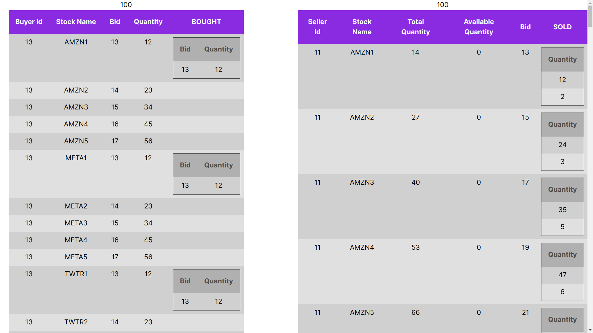

## The assignment to create a match ing engine.

1. We will be getting some buy orders to trade
2. We will be getting some sell orders to trade

## Introduction to trading!

1. A buy order contains stock-name, quantity-needed and bid (maximum price).
2. A sell order contains stock-name, quantity-available and bid (price).
3. The trade engine should fullfill a buy order by finding all the stocks with lowest price.
4. Buy order should be fulfilled in the order of their creation-date.



- You can see the [Video description](XYZ) of the appplication.

## Database: MongoDB

- [See database details.](./DockerfileMongodbReplset/README.md)

## Server

```
cd server
node index.js
```

- Test: http://localhost:3100/stocks/sell

## Web Application

```
cd client
npm install
npm run dev
```

- Test: http://localhost:3000/

## Scripts included in the directory [server/cli_scripts](./server/cli_scripts)

- Run: **node** <script_name.js>

- **drop_collections_from_db.js**

  - Clean up db data

- **push_test_data_rest_via_api.js**

  - Insert 100 buying and 100 selling trade requests.

- **trade_all_buy_requests_parallel.js**

  - This is a demo script to show what will happen if all buying requests are executed concurrently :
    1. The buying request won't get excuted in the order of created date.
    2. Database transaction conflict will occur.

## **trade_all_buy_requests_stock_name_wise.js**

### This is **trade-engine** code js file.

    1.  Group buying requests based on stock-names.
    2. Deploy threads (precisely async functions.
       Nodejs is event loop based.) for each stock-name group.
    3. Each thread will execute trade sequentially,
       which will honour created-date and avoid transaction-conflict
       since each thread accesses the documents belong to their stock-name-group.

### Sample code Run

```
cd cli_script
node drop_collections_from_db.js
node push_test_data_rest_via_api.js

node trade_all_buy_requests_stock_name_wise.js

node verify_bought_sold_are_equal.js
```

- Verify output:

```
cli_script$ node verify_bought_sold_are_equal.js
- Sold count: 2556
- Bought count: 2556
--- Sold and bought items are EQUAL.
```
